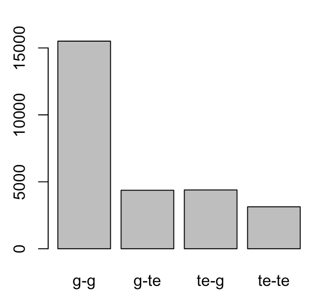
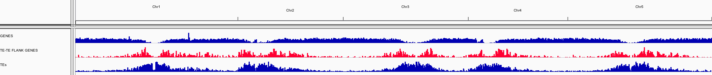
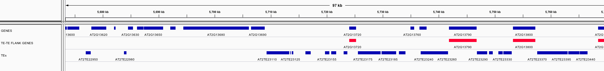

# April 4th, 2017
___

- Picked up BVZ0049 L7 sequencing data from BRF. To be loaded onto raijin

# April 3rd, 2017
___


Getting threshold value from Riyans GWAS script for Pip

```R
if(file.exists("bvz0055_repAve_pm.txt")){
   cv<- read.table("bvz0055_repAve_pm.txt",header=FALSE)
      cv<- quantile(apply(cv,1,max,na.rm=TRUE),0.95)
      cv<- cv/2/log(10)
}
```

```bash
awk '{max=$1;for(i=2;i<=NF;i++){if($i > max) max = $i}print max}' temp | Rscript -e 'quantile( as.numeric(readLines("stdin")),0.95)/2/log(10)'
```

# March 24th, 2017
___
Justin has some minion data for our digestion / gbs-style attempt with jasmine. He dropped it off this morning.

### Goals:
- Call bases for these reads
- Identify if the reads are any good to begin with
- See if there is any evidence for barcodes being present
- see if barcodes match species that were used as input DNA samples

-
The data has come in two batches:
- gbs folder has 20,300 fast5 files
- GBS2 folder has 44,575 fast5 files

These files were not basecalled initially. the first set of reads were pushed to metrichor for 1D basecalling (no barcodes, as we are not using the ONT standards)

Also trying local basecalling minion data with albacore on edmund:

https://community.nanoporetech.com/protocols/albacore-offline-basecalli/v/abec_2003_v1_revj_29nov201/run-albacore-on-linux

install instructions via ```pip3``` and `.whl` seemed to work. Can run on folder of fast5 files as follows:
```bash
read_fast5_basecaller.py --input . --worker_threads 12 --save_path ../ --config FLO-MIN106_LSK108_linear.cfg
```

the config is a provided file designed for 1D reads on the latest flowcell chemistry.

### Stage 2: What comes out

Albacore on `gbs` provided 9302 reads, however input was truncated at 14,157 fast5 files for some reason. Will re-attempt this evening.


A shit script to hunting for perfect matches to kmers in minion GBS data:
```bash
kmer=$(python kmer_gen.py | sed "s/', '/ /g" | sed "s/\['//g" | sed "s/']//g")
```

```bash
for i in $kmer; do
count=$(grep "^$i" prelim_basecalls2.fastq | wc -l);
end=$(grep "$i$" prelim_basecalls2.fastq | wc -l);
printf "$i\t$count\t$end\n";
done > temp_kmer_count

```

# Dec 2nd, 2016
___

Still trying to learn about using python, pip install, and modules on raijin

TEPID wants Python 2.7. I can load that via a module

`module load python/2.7.11`

This loading of python also provides me with `pip` so I can perform the module installation that is required:

```bash
cd $HOME/bin/TEPID
pip install -r requirements.txt --user
```
As I must install all things locally. The `--user` flag will put all the python modules into my ```.local``` directory

I can then officially install TEPID:

```bash
python setup.py install --user
python setup.py test
```

I can also now install all of the other required software as needed:

```bash
module load bowtie2/2.2.5
module load samtools/1.2
cd $HOME
cd bin

#samblaster v0.1.19
wget https://github.com/GregoryFaust/samblaster/releases/download/v.0.1.19/samblaster-v.0.1.19.tar.gz
tar -zxvf samblaster-v.0.1.19.tar.gz
cd samblaster-v.0.1.19
make
printf "export PATH=\$PATH:/home/801/sre801/bin/samblaster-v.0.1.19/\n" >> $HOME/.bashrc
cd ../

#bedtools
wget https://github.com/arq5x/bedtools2/releases/download/v2.26.0/bedtools-2.26.0.tar.gz
tar -zxvf bedtools-2.26.0.tar.gz
cd bedtools2
make
printf "export PATH=\$PATH:/home/801/sre801/bin/bedtools2/bin\n" >> $HOME/.bashrc
cd ../

#yaha
wget https://github.com/GregoryFaust/yaha/releases/download/v0.1.83/yaha-0.1.83.tar.gz
tar -zxvf yaha-0.1.83.tar.gz
cd yaha-0.1.83
make
printf "export PATH=\$PATH:/home/801/sre801/bin/yaha-0.1.83/bin\n" >> $HOME/.bashrc
cd ../
```

From this, when I make the submission scripts to run TEPID, I need to include the following lines to load the required modules:

```bash
module load python/2.7.11
module load bowtie2/2.2.5
module load samtools/1.2
```
All other requirements are found in my `$PATH` and should be good to go.

Initial test seemed to work, moving over all files and going for broke later today.

Might need to have every sample in own folder for `tepid-discover` as temp files are non-unique names...

did that with this:

```bash
READ1FILE=($(ls *R1_001.fastq.gz))

for FILE in "${READ1FILE[@]}"
do
	SAMPLENAME=(${FILE//-WGS/ })
	echo ${SAMPLENAME[0]}

	mkdir $SAMPLENAME
	mv ${SAMPLENAME}* $SAMPLENAME
	mv deletion_reads_${SAMPLENAME}* $SAMPLENAME
	mv deletions_${SAMPLENAME}* $SAMPLENAME
	mv insertion_reads_${SAMPLENAME}* $SAMPLENAME
	mv insertions_${SAMPLENAME}* $SAMPLENAME
	mv tepid_discover_log_${SAMPLENAME}* $SAMPLENAME
done

```

can run to create poly_te file for step 3:

```bash
python $HOME/bin/TEPID/Scripts/merge_insertions.py -f insertions
python $HOME/bin/TEPID/Scripts/merge_deletions.py -f deletions
```

Now to sort out the refinement step (Step 3)

```bash
for FILE in $(ls -d */)
do
    ID=${FILE::-1}
    cd $ID
    tepid-refine -i ../insertions.bed -d ../deletions.bed -p 12 -t /home/steve/bin/TEPID/Annotation/Brachypodium/Brachy_TE_v2.2.bed.gz -n $ID -c ${ID}.bam -s ${ID}.split.bam -a ../ALL_SAMPLES.txt
    cd ../
done

```

Refinement done, can now merge outputs once again (had to ask Tim on how to do this one...

```bash
for FILE in $(ls -d */)
do
    ID=${FILE::-1}
    cd $ID
    cat second_pass_insertion_${ID}.bed insertions_${ID}.bed > refined_ins_${ID}.bed
    cat second_pass_deletion_${ID}.bed deletions_${ID}.bed > refined_del_${ID}.bed
    cd ../
done

python /home/steve/bin/TEPID/Scripts/merge_insertions.py -f refined_ins
python /home/steve/bin/TEPID/Scripts/merge_deletions.py -f refined_del

python /home/steve/bin/TEPID/Scripts/merge_insertions.py -f ambiguous_insertion
python /home/steve/bin/TEPID/Scripts/merge_deletions.py -f ambiguous_deletion

python /home/steve/bin/TEPID/Scripts/genotype.py -i -a ambiguous_insertion.bed -m refined_ins.bed -s ALL_SAMPLES.txt -r Bd21-t1 > insertions_refined_genotyped.bed
python /home/steve/bin/TEPID/Scripts/genotype.py -i -a ambiguous_deletion.bed -m refined_del.bed -s ALL_SAMPLES.txt -r Bd21-t1 > deletions_refined_genotyped.bed
```


# Dec 1st, 2016
___

### Looking to get TEPID up and running on Raijin for some batch processing
Setup notes:

grabbed samtools v1.2, samblaster v0.1.19, yaha.

bedtools, bowtie2, and python already installed

making submission scripts to create bowtie2 and yaha index for Bd21 test genome. They contain the following commands:


```bash
bowtie2-build *.fa Bd21
```

```bash
yaha -g Bd21Control_SNPincorp_sgr1_genome.fa
```

working with test Bd1-1 reads (10k reads) for tepid check.

trying to get python modules setup. Nightmare so far

Ended up going with local python 2.7.12 installation. Somehow got TEPIDs ```setup.py install``` to work. Still unclear exactly how. I don't udnerstand how to get python setup correctly when there are too many fucking versions all the time.

It might be working, but it hangs. The job submission does not throw an error. It just sits there running (for test data that should take less than a min). From watching an interactive job, it is not stalled out. Just EXTREMELY slow at the yaha step. Will have to look int oit.

Rest of pipeline seems to work, trying it on Bd1-1_WGS sample now. Set walltime to 24hr given the lack of speed seen with the test.


# Nov 30th, 2016
___

Many updates lately on a variety of projects.

### 1. BVZ0049 high-depth sequencing of SP1
I got back the high-depth sequencing of SP1 on the HiSeq 2000. The BRF ran things quickly and I received the data within a few weeks. Overal things look good. Although the pooling is not perfect (as expected), the spiking in of samples did boost many of the lower yielding samples from before. Perhaps a bit too much in some cases:


Light blue highlights those that were spiked in for resequencing

So basically, almost all samples have over 10mil reads. That's a good start!

### 2. Sequencing of Plate L1 for BVZ0049
I also created libraries for plate L1. This was done in two batches of 48 samples each. The subsequent pool (92 samples?) was sequenced on the HiSeq 2500 and had a rapid turn around. I am currently aligning it.

### 3. Proper organisation of sequencing data for publicaiton, analysis, and all things
For BVZ0049, I am determined to create a proper reproducable set of scripts to conduct the entire analysis. The first goal is to push all sequencing data that I receive to the NCBI SRA first (rather than do it afterwards). In this way I can work to conduct my analysis by downloading the SRA data (as anyone else would) and verify that the results are correct.

The NCBI submission portal has been updated recently to attempt to make the process a bit more streamlined. It is still a nightmare with poor and old outdated documentation that needs to be removed.

It follows three steps:

1. Create a BioProject for the overarching experimental design and project you are working on
2. Create (in batch) BioSamples that identify the biological 'thing' - in my case an accession - that you are working on. These are all linked to the BioProject created above.
3. Create SRA submission (runs) that link to the BioSamples and BioProject. Preload fastq.gz files to NCBI via FTP and complete the bulk submission form to finalize.

To date I have put L1, L5t, SP1 (2500), and SP1 (2000) data all on SRA under project PRJNA349755

A unique aspect of my analysis goal is that hte data must be public for me to have access to it in my scripts. So I'm pushing everything to public ahead of time. I don't care anymore about people 'stealing' anything. It's all fair game and public funds = public data.

I also learned that even when SRA runs are made public, it takes some days for them to 'appear' under the NCBI FTP site for direct downloads. For instance, SRA files an be accessed through the SRAtools (```fastq-dump``` or ```prefetch```). However, these methods have their own annoyances in regards to where data is stored. I prefer to go through the direct sra file download using the syntax:

```bash
for SRAFILE in $SRALIST
do
    wget -N ftp://ftp-trace.ncbi.nih.gov/sra/sra-instant/reads/ByRun/sra/SRR/${SRAFILE::-4}/${SRAFILE}/${SRAFILE}.sra
done
```

If given a list of SRA run IDs (SRR1234567), you can find them through te above path in which you go to ```.....SRR/SRR123/SRR1234567/SRR1234567.sra```

They all appear there now so far, so I can begin planning the scripts to perform bulk downloads, converting into fastq files, and moving forward with analysis.

### 4. Creating SNP-corected genomes for BVZ0049
One of the annoyances with bisulfite sequencing is that mapping efficency is often quite low. This is in part to the fact that you are working in three-base-space rather than four. There is also the chance that real polymorphisms that exists in your sample compared to the reference may influence methylation calls as incorrect methylation levels. In the pilot experiment (BVZ0028) we had the ability to map each of the seven diverse inbred lines to SNP-corrected versions of the v1.2 reference genome. This consists of the official Bd21 genome in which all identified SNPs (as they have chromosomal positional information) are used to replace the ```REF``` base call with the ```ALT``` from the SNP identification for each line. The genomes are all then identical except for the peppering of SNP bases that have been replaced.

These SNP-corrected genomes will hopefully boost the mapping efficency a bit and also allow us to mitigate any sisues in the bisulfite data due to polymorphisms.

There is a nice part of ```GATK``` that can perform this step [FastaAlternateReferenceMaker](https://software.broadinstitute.org/gatk/guide/tooldocs/org_broadinstitute_gatk_tools_walkers_fasta_FastaAlternateReferenceMaker.php)

It requires the reference, as well as a ```VCF``` files containing the variants. This is where the problem lies at the moment.

The SNPs that have been used to date in identifying the samples for BVZ0049 were made by Jared ~2 years ago. They also were made through TASSEL which does not, by default, export VCF files. I also need to make sure that I have SNPS that are 'reference-based' in that they have positional information to allow the replacement. Jared is apparently working on updating these SNP lists and will create VCF files. Hopefully this is true as I would like to use the data that is final for whatever his manuscript is using. I want our science to be cohesive and comparable. I also don't want to try calling SNPS myself for no reason.

### 5. Using TEPID on Paired-End Nextera Brachypodium data
Norman recently moved forward with creating whole genome shotgun (WGS) data on over 100 Brachypodium samples in the lab as a test of the nextera protocol as well as some new data to try calling SNPs. This data is perfect for trying to identify transposable element variants across some of the same BdTR lines that are used in BVZ0049. Therefore I have been trying to get Tim Stuart's [TEPID](https://github.com/ListerLab/TEPID) pipeline up and running on edmund.

TEPID has some fairly strict software version requirements (samtools v1.2 only for example) which were a headache to pull together. However it does seem to be working through the ```tepid-map``` and ```tepid-discover``` steps of the pipeline. I am currently running these steps across all of the samples. Once done, I will collapse insertiosn and deletions and attempt to perform the genotyping step of TEPID. My hope is to create a final dataframe of all accessions and all TEPID calls with presence/absence calls for each. This will be a cool dataset to explore and compare to the Arabidopsis work as well as set a pilot for performing more TEPID analysis on diverse grass species.

# Oct 19th, 2016
___

With some of the final logistics of ordering for BVZ0049 complete, I can begin to plan the subsequent labwork and analyses.

To recap, there were seven plates of gDNA that were isolated from the chambers of BVZ0049: 6 full (96 samples) and 1 partial (28 on plate 7).

I have performed methylc-seq on plate 5 as 'l5t' which was the initial **L**-ibrary plate **5** **t**-est. This sequencing from a HiSeq 2500 flowcell is in my hands (SN877_0399) and appears to be of fair quality (got 82 of 96 samples with data).

I have also pulled samples from across multiple plates to form 'SP1' which is __S__-ample __P__-late __1__. This is a specific set of lines from clonal clades 1 and 6 from the spring conditions (along with 8 Bd21 controls). These have been skim sequenced (SN877_0432) across a HiSeq 2500 flowcell.

The SP1 library pool was adjusted after this test run to try and equalize the proportions of each samples within the library a bit better. The initial read counts from SN877_0432 are here:


Alhtough this was supposed to be an equal molar pool, there is clearly some variation. Now, I know it will never be perfect as I am trying to pool such a large number of samples. However I hope to pull up some of the lower samples specifically. One interesting result is that there was some general overestimation of the nanomolarity from the GXII quantification for the last two plates. This seems tied to the result that many of the lowest readcount samples actually had some of the higher nM values:


_In a perfect world this would be a flat horizontal line in which the initial nM calculation was not related to final readcound at all_

A major limitation of my third-reaction protocol is that I do not have much library to work with in the end. Because of this, I cannot truly re-pool these libraries. Instead, I have added a 'spike in' value that should hopefully bolster some of the poorest performing libraries. This was done by myself and I sent off this new **SP-1bs-P2spri** pool to the BRF yesterday. It will be run across an entire flowcell in Highoutput HiSeq 2000 mode. This is an expensive run, but will hopefully provide some depth to these specific samples moving forward.

Outside of this SP1 set, I have also gone through and performed bisulfite conversion on _almost_ all of the gDNA samples. I have 6 plates that are awaiting library creation, pooling, and skim sequencing on the 2500:

- Plate L1
- Plate L2
- Plate L3
- Plate L6
- Plate L7

I have omitted Plate L4 at the moment as it has ened up as a partial plate. It will be finalized after the others have been sequenced to hold as many redo samples as possible (as certainly some will fail).

I still have high hopes that the vast majority of samples will be sequenced with good data. I know that some may not make it which will be annoying for replication work. However, trying to cordinate over 600 samples is pain enough already. I will try to pickup as many failed samples as possible, although I won't try for too long.


# Oct 4th, 2016
___

Another MinION run

My replacement flowcell is a SpotON model (MIN105). This has a slightly different protocol for priming and loading a flowcell.

I also leared that any air bubble = instant dead pores. The last priming step is adding 200ul to the sample port when the spot on port is already open. I saw what appeared to be an air gap in the sample port area, and attempted the standard 'pull a bit off'. However, with the SpotOn port open, it lead to negative pressure over the array and a brief (less then 1 second) air pull into the spoton port and over the array. Althoug extremely brief, it appears to have killed ~200 pores from my previous QC and is clearly visable on the running screen (right side, big blue). This area of dead pores is right under the spoton opening.:


**Lesson learned, never provide negative pressure on flowcell when spoton port is open.**

This is also a test of some old Bd21 Brachypodium distachyon gDNA that was prepped in our lab over a year ago using Qiagen kits. This is our standard method of extracting gDNA in the lab, and it will be interesting to see how it sequences compared to CTAB preps such as what Ben performs.

# Sept 20th, 2016
___

### Brachypodium genome version nightmares

### TAKEHOMES:
```
- Community is fragmented!
- Paper worked with v1.2 of Bdistachyon reference
- Phytozome V9
- TE annotations v2.2 from http://pgsb.helmholtz-muenchen.de/plant/brachypodium/download/index.jsp
- Gordon et al developed SNP-corrected genomes in v1.2, however somewhere along the line they have been making VCF files for updated versions (v2.1)
- HARD TO FIND MANY OF THESE FILES ON NET!
```

I am trying to confirm the versions of the genome and annotations used in my recent Genome Research paper. This is done in part to make sure there was no cross-contamination of file versions anywhere when it comes to providing reproducable data for the analyses in the paper.

### Genomes

There are 4-5 full versions of the _Brachypodium distachyon_ genome to date as far as I can tell:

**v1.0 - the initial publication data**

The IBI data

**v1.2 - Phytozome V9 release**

This did NOT change the actual genome sequence from v1.0. Only the annotations
This is referenced as ```Bdistachyon_192_...``` when it comes to public files. This version can also be identified by having five pseudomolecules (Bd1 through Bd5) along with 78 ```scaffold_XXX``` fragments within the fasta files

**v2.1 - Phytozome V10 release**

This is a true new assembly and new annotations. Referenced as ```Bdistachyon_283_...``` in public Phytozome files. This has the 5 main pseudomolecules with only 22 ```super_XXX``` scaffold fragments.

**v3.0 - Phytozome V11 ??**

Another new version, not sure what it is used for. Files ID's as ```Bdistachyon_307_...```

**v3.1 - Phytozome V11 release**

This is the current release containing ```Bdistachyon_314_...``` files.

The Genome Research paper uses SNP-corrected fasta files that were once public on brachypodium.org. I found them on Todd Mockler's FTP site today as well. These reference the 78 ```scaffold_``` fragments in the genome sequence so I believe these to be SNP corrected versions of the v1.2 genome release.

### Annotations used in the MS

**SNP data from Gordon et al**

With this knowledge in hand, it certainly seems that the resequencing of the 7 diverse inbred lines occurded with v1.2 genomes. There is a vcf file provided in Phytozome V9 under 'diversity' that has SNP calls for the seven lines as ```Bdistachyon_192-GATK_filtered.vcf.gz```. I have yet to confirm exactly how filtered this file is compared to the results in Gordon et al.

However, Gordon and co appear to have also been updating their SNP calls in VCF files provided to v2.1 of the genome as ```Bdistachyon_283.vcf```. There is not a file for v3.0 or v3.1.

**gene annotations**

I used the v1.2 gene annotations from ```Bdistachyon_192_gene.gff3```

**Transposable elements**

This is a bit more confusing. The v1.0 genome manuscript highlights some results from different TE superfamilies, however there does not appear to be a public file of all annotated TEs in this release.

The files that I used came from PGSB [Brachypodium distachyon project](http://pgsb.helmholtz-muenchen.de/plant/brachypodium/download/index.jsp)

They noted that their annotations are to the v1.0 (v1.2) assembly. Their TE annotations are named as ```MIPS_Bd_Transposons_v2.2_16-07-2009.gff3```

What this means moving forward is that if I want to leapfrog up to v3.1 of the genome, I may need to make my own repeat annotations (!) or see if the PGSB people are planning to rework it for the newer version.

**locaTE analysis from TIM**

Tim used the TE annotation and SNP-corrected genomes I provided back at the time, so all the locaTE calls should be also based off the v1.2 genome assembly and annotations.

This also notes that the Genome Research paper was completed with v1.2 data and annotations.

___
# Sept 2nd, 2016
___

### More MinION analyses
### TAKEHOMES:
```
-
-
```

Two days ago, I started to upload the 1D basecalled fast5 files into Metrichor for their Lamda alignment pipeline. I first found that if I started the Metrichor app with the entire directory of files, it seemed to stall out instantly. I seem to have gotten around that by first starting it with just a handfull of fast5 files, then adding the rest into the directory.

These Metrichor pipelines are made to stream data to the cloud, do something, then return data files to you (basically appended fast5 files with more bits inside them).

So far, it seems to move files up there extremely slowly (I'm 2 days into this pipeline and still uploading files!) Hopefully this can be sped up...

The Metrichor alignment is based on the [lastal alignment software](http://last.cbrc.jp/)

The pipeline is working. I'm seeing about 80% alignment accuracy. ~1000x + coverage of the lamda genome:


The MinION creates fast5 files during the initial mux work when the sequencing protocol is starting. There are 92 mux fast5 files created. After sequencing, there were 38,398 lamda fast5 files for a total of 38,490 that are being processed by Metrichor.

All files are uploaded (2pm), however I don't have a clue if the actual steps in the cloud are all done or not. Perhaps so? I've download all reads that I sent up, so perhaps it is done?


### Final results of Metrichor alignment

I'm having trouble trying to track down where all the reads go. I have downloaded the same number as I uploaded:

| type | pass | fail | total |
|---|---|---|----|
| mux | 22 | 70 | 92 |
| lamda | 26685 | 11712 | 38397 |
| | | **Total** | 38489 |

I want a flowchart of where these numbers end up, as there are different numbers in the Metichor report at the moment that don't add up.


# Aug 31st, 2016
___
### Working on MinION data analysis
### TAKEHOMES:
```
- These are still early days
- Best practices have changed before I finished this sentence.
```

With lamnda control DNA sequencing completed, I can begin to figure out what to do with this new long read data. Sequencing needs to be viewed from a series of steps:

1. **Raw data from the sequencer** which is signal traces from the MinION as a molecule moves through a pore. This is the equivilant stage as initial image data from an Illumina platform.
2. **Calling bases in reads** to go from the raw data into an A,T,C,or G. At the moment there are a handful of ways to perform this with MinION data (discussed below). The current options for this are (MinKNOW 1.0.2, nanonet, and [nanocall](http://biorxiv.org/content/early/2016/03/28/046086)
3. **Filtering reads for downstream analysis** in which a quality metric is used to cull poor quality reads
4. **Downstream analysis** in which we now use these reads for something biologically interesting

These steps are fairly well defined when using short read data (i.e. Illumina), however I have realized that this is still the wild west when it comes to Nanopore sequencing.

Data is stored in a fast5 format which is basically an hdf5 formatted datafile [https://www.hdfgroup.org/HDF5/](https://www.hdfgroup.org/HDF5/) with the following structure:

MinKNOW (as of v1.0.2) can perform basecalling on your local machine for 1D chemistry (i.e. the Rapid sequencing kit I have). This develops fast5 files as such:

```
/{attributes: file_version}
|-UniqueGlobalKey/
|      |-tracking_id/{attributes: asic_id_17, asic_id, asic_id_eeprom, asic_temp,
 device_id, exp_script_hash, exp_script_name, exp_script_purpose, exp_start_time,
 flow_cell_id, heatsink_temp, hostname, protocol_run_id, protocols_version_name,
 run_id, version, version_name}
|      |-channel_id/{attributes: channel_number, digitisation, offset, range,
 sampling_rate}
|      |-context_tags/{attributes: set when the experiment is configured}
|-Raw/
|      |-Reads/
|             |-Read_42/{attributes: start_time, duration, read_number, start_mux,
 read_id}
|                    |-Signal{samples}
|-Analyses/
|      |-Basecall_1D_000/{attributes: name, version, time_stamp}
|      |      |-BaseCalled_template/
|      |      |      |-Fastq{text}
|      |      |-Summary/
|      |      |      |-basecall_1d_template/{attributes: num_events, called_events,
 sequence_length, start_time, duration, mean_qscore, strand_score}
|
```
Although this file format is likely useful, it requires some specific software to fully parse.

As an HDF5 file format, we can parse it in R using some bioconductor libraries such as [rhdf5](http://bioconductor.org/packages/release/bioc/html/rhdf5.html)

Here is an example in which we can dive into this structure and read actual data (raw signals, fasta, fastq, alignments, etc) as well as attribute data (i.e. metadata about the file):

```R
library(rhdf5)
pass=H5Fopen('rsb0001259_local_20160830_FNFAD24036_MN19089_mux_scan_lamda_ctr_exp_72436_ch242_read568_strand.fast5')

head(pass$Raw$Reads$Read_568$Signal)
[1]  277  802 1227 1221 1215 1208

h5readAttributes(pass,'/Raw/Reads/Read_568')

$duration
[1] 37505

$median_before
[1] 45.77394

$read_id
[1] "0da6697a-bd53-496a-a990-4d3423d4940e"

$read_number
[1] 568

$start_mux
[1] 4

$start_time
[1] 1323069

#5hls(pass) would act similar to str() to show you what the structure looks like
```

Can also use [HDFView from the HDF group](https://www.hdfgroup.org/products/java/release/download.html) to look into these fast5 files.

[Poretools](https://github.com/arq5x/poretools) seems like the best set of scripts to currently look at these fast5 files. I ran the sequencing with the recent local 1D basecalling which means that my fast5 files should contain basecalls. Nanopore notes that these basecalls may be ever so slightly different than those from the EPI2ME pipelines as they use some different metrics, however I have yet to dive deep into that. Looking at my MinKNOW fast5 output folder:

```bash
cd /Library/MinKNOW/data/
poretools stats reads

total reads	27066
total base pairs	143119010
mean	5287.78
median	3466
min	93
max	109367
N25	14725
N50	8768
N75	4773
```

I can tell that sequences are certainly present within the files that were created. About 27000 reads creating 143Mb sequence

However, I'm having issues getting the other, more useful parts of poretools working as it keeps throwing errors:

```bash
poretools readstats reads | head

Traceback (most recent call last):
  File "/usr/local/bin/poretools", line 9, in <module>
    load_entry_point(poretools==0.5.1, console_scripts, poretools)
start_time	channel_number	read_number	template_events	complement_events
  File "/usr/local/Cellar/python/2.7.9/Frameworks/Python.framework/Versions/2.7/lib/python2.7/site-packages/poretools-0.5.1-py2.7.egg/poretools/poretools_main.py", line 531, in main
    args.func(parser, args)
  File "/usr/local/Cellar/python/2.7.9/Frameworks/Python.framework/Versions/2.7/lib/python2.7/site-packages/poretools-0.5.1-py2.7.egg/poretools/poretools_main.py", line 55, in run_subtool
    submodule.run(parser, args)
  File "/usr/local/Cellar/python/2.7.9/Frameworks/Python.framework/Versions/2.7/lib/python2.7/site-packages/poretools-0.5.1-py2.7.egg/poretools/readstats.py", line 9, in run
    start_time = fast5.get_start_time()
  File "/usr/local/Cellar/python/2.7.9/Frameworks/Python.framework/Versions/2.7/lib/python2.7/site-packages/poretools-0.5.1-py2.7.egg/poretools/Fast5File.py", line 476, in get_start_time
    node = self.find_event_timing_block()
  File "/usr/local/Cellar/python/2.7.9/Frameworks/Python.framework/Versions/2.7/lib/python2.7/site-packages/poretools-0.5.1-py2.7.egg/poretools/Fast5File.py", line 446, in find_event_timing_block
    path = fastq_paths[self.version][template] % (self.group)
KeyError: template
```

Still trying to figure that one out..

As a comparison, I took the fast5 files created by MinKNOW and extracted fastq reads and mapped them to a lamda genome I grabbed from NCBI which I am taking to be 'close enough' to the proper genome.

[http://www.ncbi.nlm.nih.gov/nuccore/9626243?report=fasta](http://www.ncbi.nlm.nih.gov/nuccore/9626243?report=fasta)

This was then mapped using bwa:

```bash
poretools fastq /Library/MinKNOW/data/reads/*.fast5 > test_lamda_allreads.fastq

bwa index test_lamda.fasta
bwa mem test_lamda.fasta test_lamda_allreads.fastq > test_lamda.sam
samtools view -Sb test_lamda.sam > test_lamda.bam
samtools sort -T temp.sorted -o test_lamda.sorted.bam test_lamda.bam
samtools index test_lamda.sorted.bam

samtools flagstat test_lamda.sorted.bam

48631 + 0 in total (QC-passed reads + QC-failed reads)
0 + 0 secondary
21565 + 0 supplimentary
0 + 0 duplicates
41378 + 0 mapped (85.09%:nan%)
0 + 0 paired in sequencing
0 + 0 read1
0 + 0 read2
0 + 0 properly paired (nan%:nan%)
0 + 0 with itself and mate mapped
0 + 0 singletons (nan%:nan%)
0 + 0 with mate mapped to a different chr
0 + 0 with mate mapped to a different chr (mapQ>=5)
```

Other software that may be useful:

NanoOK [https://documentation.tgac.ac.uk/display/NANOOK/NanoOK](https://documentation.tgac.ac.uk/display/NANOOK/NanoOK)

poRe [https://github.com/mw55309/poRe_docs](https://github.com/mw55309/poRe_docs)

___

# August 30th, 2016
___
### Performed Lamda control DNA MinION sequencing using the Rapid sequencing kit (SQK-RAD001)
### TAKEHOMES:
```
- Take photographs of all flowcells before and after sequencing for recording purposes
- The flowcells themselves are bubble traps!
- Try to prevent ever removing liquid from the sensor array on flowcell
- Sequencing did appear to work. Will work on analysis later.
```


Started earling in the morning to perform the lamda sequencing run in which all MinION customers are to do for general QC and working with the wet lab component for sequencing.

The protocol itself for creating the library is dead simple. Following the CompanION for 'Rapid Lamda control experiment' had no issues. Only really need a thermocycler for a 1min 30C and a 1min 75C temp.

Flowcell FAD23939 had air bubbles across sensor pore array (the part that matters). Attempted to remove by pipetting out small volume of buffer from sample port to no avail. QC run indicated basically no useable pores (!). Ben Schwessinger was present to observe and tried pulling buffer completely off array and re-adding. This did remove the observable bubbles. QC after this still indicated zero active pores. Compare these results from today against initla QC check when flowcell was received:

### FAD23939 QC pore counts to date:
| Pore group | Pore count - Aug 11th | Pore count - Aug 30 (bubbles) | Pore count - Aug 30 (buffer movement, no bubbles) |
|--|--|--|--|
| 1          |         361|4 | 0|
| 2          |         317|1 | 0|
| 3          |         210|0 | 0|
| 4          |          74|0 | 0|
| **Total**      |         962|5 | 0|

So something went seriously wrong with chip after storing it in our fridge (at the desired 2-8C temp). I do not remember there being any bubbles present when package was opened, so perhase they developed over time in fridge?

Here is a picture of the flowcell after Ben re-applied the buffer across the sensor array. Note that there still appears to be a bubble-ish points near the ends of the sensor array:


Given this mess, I used the other flowcell that was provided (FAD24036) for the lamda control experiment. This flowcell was QC'd for pore counts twice. Once specifically, and a second time during the sequencing run protocol (so pore counts are always determined right before seuqencing). The results are as follows:

### FAD24036 QC pore counts to date:
| Pore group | Pore count - Aug 11th | Pore count - Aug 30 QC | Pore count - Aug 30 in sequencing |
|--|--|--|--|
| 1          |         506|505|498|
| 2          |         448|448|439|
| 3          |         308|313|275|
| 4          |          104|111|77|
| **Total**      |      1366|1377|1289|

So the pore counts appeared just fine and fairly consistant going into the sequencing itself. No bubbles were visable prior to sequencing.

I seledted to have MinKNOW perform local basecalling rather than using Metrichor to call bases in the cloud. Therefore, sequencing commenced using the MinKNOW protocol ```NC_6Hr_Lambda_Burn_In_Run_FLO_MIN104_plus_1D_Basecalling.py```. Everything appeared to work properly, however the tab for local basecalling metrics (quality and read length) never filled in. The overall read size histogram did though.


Will check with Nanopore if there is some issue with MinKNOW currently.

This ran for 6 hours. At the end of 6 hours the program did appear to complete on its own and return me to the MinION status page. However the computer was still quite busy using its processors for something with MinKNOW.

The flowcell was then washed using the flowcell wash kit. After the 6 hour run, there were multiple bubbles now present on the flowcell:


These bubbles remained after washing and returning to fridge:


# Aug 9th, 2016
___

Getting B stacei annotation files created for Beth

```R
getAttributeField <- function (x, field, attrsep = ";") {
     s = strsplit(x, split = attrsep, fixed = TRUE)
     sapply(s, function(atts) {
         a = strsplit(atts, split = "=", fixed = TRUE)
         m = match(field, sapply(a, "[", 1))
         if (!is.na(m)) {
             rv = a[[m]][2]
         }
         else {
             rv = as.character(NA)
         }
         return(rv)
     })
}
### #######
gffRead <- function(gffFile, nrows = -1) {
     cat("Reading ", gffFile, ": ", sep="")
     gff = read.table(gffFile, sep="\t", as.is=TRUE, quote="",
     header=FALSE, comment.char="#", nrows = nrows,
     colClasses=c("character", "character", "character", "integer",  
"integer",
     "character", "character", "character", "character"))
     colnames(gff) = c("seqname", "source", "feature", "start", "end",
             "score", "strand", "frame", "attributes")
     cat("found", nrow(gff), "rows with classes:",
         paste(sapply(gff, class), collapse=", "), "\n")
     stopifnot(!any(is.na(gff$start)), !any(is.na(gff$end)))
     return(gff)
}
```

```R
data=gffRead('Bstacei_316_v1.1.gene.gff3.gz')
geneID=getAttributeField(data$attributes, "Name")
data2=cbind(data,geneID)
data2.gene=subset(data2,data$feature=='gene')
out=data2.gene[,c(1,4,5,10,6,7)]

write.table(out,'Bsta.gene.bed',sep='\t',row.names=F,quote=F,col.names=F)
```

# Aug 8th, 2016
___

MinION arrived

attempting configuration test cell

- 19089 MinION Identifcaion
- flowcell 285382121
- sample sre_ctc1
- NC\_CTC_Run

This is the configuration test cell that was present in the MinION upon arrival. Was run through the MinKNOW software. I need to determine if all was successful (I think it was)

Also going through the test data upload of Metrichor to confirm that bass calling will work well.


# Aug 4th, 2016
___

Attempting to run DSS on C24 and Ler CG methylation as I had to remap Ler yesterday.

So you are required to use data smoothing when you do not have biological replicates in DSS. Therefore the output I created was:

- CG DMRS
- p threshold 0.01
- data smoothed

This results in 10224 CG DMRs between C24 and Ler. I have passed them to Ian in case he wants to compare with our tile approach.

# Aug 3rd, 2016
___

### #Preparing Ian's samples for DSS analysis

We may need to attempt using DSS (bioconductor.org) to call DMRs across the C24 and Ler parental inbreds for Ian's TCM and TCdM reviews. I am attempting to prepare samples and data formats for this possibility.

There is a specific file type that is wanted for input into DSS. From the documentation:

___
DSS requires data from each BS-seq experiment to be summarized into following information for each CG position:
- chromosome number,
- genomic coordinate,
- total number of reads,
- and number of reads showing methylation.

For a sample, this information are saved in a simple text file, with each row representing a CpG site. Below shows an example
of a small part of such a file:

| chr   | pos     | N  | X  |
|--|--|---|---|
| chr18 | 3014904 | 26 | 2  |
| chr18 | 3031032 | 33 | 12 |
| chr18 | 3031044 | 33 | 13 |

___

So, we can make this data from our bismark cov files

```bash
#from bismark alignments output folder...
awk '{print $1"\t"$2"\t"$5+$6"\t"$5}' C24_CHH.bed.bismark.cov > C24_CHH.dss.txt
awk '{print $1"\t"$2"\t"$5+$6"\t"$5}' C24_CHG.bed.bismark.cov > C24_CHG.dss.txt
awk '{print $1"\t"$2"\t"$5+$6"\t"$5}' C24_CpG.bed.bismark.cov > C24_CG.dss.txt

awk '{print $1"\t"$2"\t"$5+$6"\t"$5}' Ler_CHH.bed.bismark.cov > Ler_CHH.dss.txt
awk '{print $1"\t"$2"\t"$5+$6"\t"$5}' Ler_CHG.bed.bismark.cov > Ler_CHG.dss.txt
awk '{print $1"\t"$2"\t"$5+$6"\t"$5}' Ler_CpG.bed.bismark.cov > Ler_CG.dss.txt
```

Throw on 'chr', 'pos', 'N', and 'X' as column names using nano.

Can then start attempting DSS:

```R
library(DSS)
library(bsseq)
c24=read.delim('C24_CG.dss.txt',head=T)
ler=read.delim('Ler_CG.dss.txt',head=T)
BSobj = makeBSseqData( list(c24, ler),c('C24','Ler'))
BSobj

dmlTest = DMLtest(BSobj, group1=c("C24"), group2=c("Ler"))
dmlTest.smoothed = DMLtest(BSobj, group1=c("C24"), group2=c("Ler"),smoothing=T)
head(dmlTest)
head(dmlTest.smoothed)

dmrs=callDMR(dmlTest,p.threshold=0.01)
dmrs.smoothed=callDMR(dmlTest.smoothed,p.threshold=0.01)
head(dmrs)
head(dmrs.smoothed)

#showOneDMR(dmrs[1,],BSobj)
write.table(dmrs.smoothed,'C24vsLer_CGDMRS.dss.txt',sep='\t',row.names=F)

```

# July 29th, 2016
___
### Justin Borevitz - 'omics for selection

__Plant climate__

- specificity (selecting zones and seasons for what to plant where)
- sensitivity (diversification under variable climates and environments; require general hardiness)

__'Pre-breeding for Adaptation'__

Geno - Pheno - Enviro triangle

```
Better understanding statistical models that can association and predict phenotype from genotype.

A whole lot of talk, little substance so far
```

__Breeding paradigm__

collect lines
cycle in with phenotyping, selection, and breeding

Requires global phenotypic screens across a large number of conditions

Make predictions across huge swaths of accessions and populations

```
So many buzz words
```

DivSeek ```http://www.divseek.org/```

```
It's all good ideas and concepts, but requires serious manpower and $$$$ to actually perform in any meaningfull way
```

### Steven Swain - CSIRO

data61

Digiscape FSP

FSP Environomics Collaboration-Hub

CSIRO is global impact and revenue focused

transforming nitrogen fixation into crops and plants

Topical RNAi application (a la Monsanto Bioactive)

Association expression level with phenotypes across multiple environments


# July 19th, 2016
___

Tim Stuart has provided new files to attempt the trans TE-DMR analysis for his manuscript. Previously, both TEPID insertions and deletions were combined into a 'TE_poly' file containing both types of elements. However, further analysis by Tim has indicated that it may be worthwhile to look at these two types of variants seperatly. Beyond this, there was an issue with the methylation DMR files indicating no coverage as a value of 0, which could seriously screw things up.

Therefore, I am revisiting the TE-DMR trans association analysis and performing it four times for these datasets:

- C DMRs (13484) vs TE insertions (15077)
- C DMRs (13484) vs TE deletions (5856)
- CG DMRs (40268) vs TE insertions (15077)
- CG DMRs (40268) vs TE deletions (5856)

Tim has provided new files for methylation ```c_dmr_allC.tsv``` and ```cg_dmrs_allC.tsv``` as well as new dataframes of TE insertions ```TE_insertions_matrix.tsv``` and deletions ```TE_deletions_matrix.tsv```

All code and results for each analysis are found in their respective folder and ```TIM_TRANS_ANALYSIS_JULY2016.html``` file.

To begin, dataset accessions are confirmed identical resulting in 136 accessions. We trim this down to 124 accessions that were identified in the TE-to-SNP LD analysis to eliminate some of the populations structure found across these accessions.

TE variants are subset to only those 'common' variants with a minor-allele-frequence > 3% (4 accessions). This substantially cuts down on the number of TE variants that we can test:

| TE set     | raw variants | >3% MAF | proportion kept |
|--|----|--|----|
| insertions | 15077        | 2782    | 0.185           |
| deletions  | 5856         | 2859    | 0.488           |

We can also calculate the FDR for each of these association tests by counting the number of associations above our 1% permuted data threshold as so:

(count above real - count above perm) / (count above real)

Which gives us....not the best FDR in the world:

| FDR %  | individual r2 values | sum r2 values | individual binary states | sum binary states |
|----|---|--|----|---|
| C_ins  | 14.38                | 87.77         | 14.38                    | 77.77             |
| C_del  | 17.17                | 87.65         | 17.16                    | 81.29             |
| CG_ins | 7.55                 | 52.54         | 7.55                     | 21.62             |
| CG_del | 10.27                | 47.27         | 10.26                    | 25                |

Even so, we can get a count of our punative trans-associated TE variants for each contrast:

| possible trans Tes | count | max DMRs it hits | max %DMRs it hits |
|----|---|--|---|
| C_ins              | 126   | 526              | 3.901             |
| C_del              | 155   | 457              | 3.389             |
| CG_ins             | 37    | 2021             | 5.019             |
| CG_del             | 40    | 2395             | 5.948             |

So if I'm honest, I think we don't really have any evidence of trans bands. In fact, if we look at the plotted heatmaps it is much harder to identify the cis-band going up the diagonals of the C DMR set.

If anything, we see lots of horizontal bands, which may indicate that we would need to do some heavy filtering of the Schmitz DMR calls in order to try and clear things up. I'm not sure how to best approach that however.


# June 17th, 2016
____


There are some revisions to be done in regards to the Brachypodium distachyon reference methylomes manuscript. I am trying to organize my thoughts and scripts to have a clearer picture of exactly what is being done and where any new analyses will fit in:

In the end what I, and everyone else, should be doing is identifying the time in which a manuscript will be created and directly begin organizational steps in order to prepare for publication and reproducibility.

There are key steps to making this a reality

- __Start by uploading any created sequencing data to a public repo EARLY ON.__ By doing so you have completed one of the most annoying steps of any genomic paper prep. A specific benifit of doing this early on is that you can develop your analysis scripts to start directly from pulling sequence data (e.g. from the SRA). If you are smart you can create scripts that can flag off this step for subsequent analyses when you have the sequencing data in hand (the same holds true for any time-consuming steps such as read alignment).

- __Keep an up-to-date tab on any third-party data that is used within your analyses.__ Everythign we do often builds on other labs data, or other public annotation information that is associated with your experimental system. This includes reference genome(s), gene annotations, and other public annotations which may be used within your analysis. By knowing what _version_ as well as the public _location_ of such data (TAIR, Phytozome, genome connsortium, etc) you will make your own life, and others reproducing your results, easier.

- __Timestamp everything.__ Analysis often beings in a 'dirty phase' of analysis with rapid testing and code/plots/data tables that are good, bad, and ugly. Often you begin building off of these for downstream steps. You often never know that a specific step or output will make it out of this phase. Devise a clear timestamp method for any output of any script. This allows you to keep track of when certain files were made, and forces a clear naming convention for your own sanity.

- __Try to get as close to final publication figures from first output.__ From my experience, the effort you put into a 'final' figure is often left behind when the 'final' figure is no longer actually final. There are often changes, edits, tweaks that may require a new primary figure or plot to be developed which is not always easy to slot into the edited manuscript figure. I have often spent a fair amount of time in Illustrator getting things just right only to have a _plot.v3USETHISONE.pdf_ get spit out right at the end requiring an additional round of finalization for publication. This is inevitable as far as I can tell. Therefore, taking the time to make your plotting software (ggplot is my go to) get as close as possible to what you want in the end. This includes colors, legends, labels, font sizes, etc. The more you can code into your scripts, the easier it will be to deal with any last minute changes.

- __When you have completed all of this, make sure the first steps of the script highlight the required software, libraries, and disk space needed to make things work.__ If you make it this far, you may just have a script which will generate everything you made. Well done! However, take the time to clearly identify the specific software and libraries required for your scripts to work. Best practices would also include the specific versions of all items that you used as they seem to change and break things quite often.


My personal goal would be to develop a series of scripts in which with the scripts alone it would:

- Download all primary data
- Download all annotation third-part data required
- Perform all base processing of data
- Perform all biological analyses performed in the paper
- Output semi-finished versions of all primary and supplemental figures and tables (noting that they may be cleaned further in Illustrator for publication)

This is much easier said than done. I have yet to personally meet this goal. I imagine that this level of organization requires one to accept that you will get so far with first-pass analyses and developing your results, then have to _start from the beginning_ with this organization in mind. Things should move faster at this point because you know where you are headed (rather than in discovery phase).

I have also been continuing to try and find the best method for pulling scripts together to include code for all aspects of the required software. I often move from bash scripts to R, back to bash, and sometimes others which would require a more unified method. Right now I often develop R scripts with commented out bash code which I manually execute while walking through the script. I don't like doing this and either would any person trying to re-develop your results and analyses.

I imagine that beyond this would be a magical world of VMs that someone could spin up to do all of this in the cloud, however I'm still focused on these baby steps.


# May 9th, 2016
___

Trying to understand _Probability Theory - The Logic of Science_ by E.T. Jaynes

### Probability defined for:
- Frequency & Fair odds
(dice rolls, gambling)

vs

- credible, sound judgements
(finding expectations from incomplete information)
- Kolmogorov
-
### Statistics
- from the state for mathematical analysis of affairs
- defining measurement error
- sampling variation

Laplace

- Linear regression
- Distribution of errors

Inference (Fisher & Pearson)

- How do we infer the true 'state of being'?
- p-values
- confidence intervals
- hypothesis testing

Bayesian statistics

- How do prob estimates get updated given new data?
- conditional probabilities

Given all of this, what exactly is probability in the real world?

### Freqentist

- counting, _measurements_ of a physical prop, sampling,
- This only really makes sense when we can make the measurements
vs

### Subjectionist

__'A degree of belief'__ - something we all have

- Given we cannot simulate worlds to test outcomes, what do we do when we cannot measure directly
- It is naturally uncomfortable to include our subjective degrees of belief
- What if we have different degrees of belief when we can properly test (roll the dice)?
- Kolmogorov axioms don't necessesarily fit well here

Is probability forwarding looking and statistics backward looking?

in this book, Jaynes frames probability as an extention of LOGIC specifically.
We are reasoning with incomplete information. We can get Kolmogorov axioms as a derivitive of logic. From this, the separation of probability vs statistics dissapears. Also destroys frequentist ad hoceries and methods as a fundamental misunderstanding of probability.

In doing so, Jaynes shows that a subjectionist view allows for more powerful statements.

Hypothesis to Data (test hypothesis to explain our data) is not good. We want __Data to hypothesis__ (the thing in the real world)

### Resolves about 400 years of prob theory by extending logic!

___

# April 18th, 2016
___

Created folder structure on local machine for IGV sessions for Joanne's methylc-seq data visualizations.

bis snp snp-calling from bisulfite sequencing data for Diep's work.

___
# April 14th, 2016
___
The alignments of Joanne's Methyl-seq data has been completed on edmund. The summary information is provided below:

| Input fastq | Sample | ref genome | method | bismark ver | samtools ver | total reads | flt reads | % unique aligned | unique map | multi-map | no-map | %CG | %CHG | %CHH |
|--|--|--|----|---|--|----|---|---|--|---|--|--|--|----|---|
| Col_mock_C_R1.fastq.gz | Col_mock_3DAI | ../../genomes/TAIR10/assembly/ | se | v0.13.0 | 1.1-26-g29b0367 | 32705946 | 32652653 | 78.1 | 25507247 | 1958063 | 5187343 | 23.2 | 7.5 | 2.2 |
| Col_Fox_D_R1.fastq.gz  | Col_Fox_3DPI  | ../../genomes/TAIR10/assembly/ | se | v0.13.0 | 1.1-26-g29b0367 | 29501104 | 29460765 | 67.6 | 19925070 | 5170754 | 4364941 | 21.8 | 7.0 | 2.1 |
| rdd_Fox_B_R1.fastq.gz  | rdd_Fox_3DPI  | ../../genomes/TAIR10/assembly/ | se | v0.13.0 | 1.1-26-g29b0367 | 29645007 | 29612191 | 67.7 | 20055251 | 5865639 | 3691301 | 23.0 | 7.0 | 2.0 |
| rdd_mock_A_R1.fastq.gz | rdd_mock_3DPI | ../../genomes/TAIR10/assembly/ | se | v0.13.0 | 1.1-26-g29b0367 | 36957919 | 36915555 | 80.1 | 29574380 | 1810380 | 5530795 | 23.6 | 7.3 | 2.1 |

Another important note is calculating the bisulfite conversion rate by looking for methylated cytosines in the chloroplast (which is unmethylated). This can be done via the output files and a bash one-liner:

~~~bash
grep "ChrC" *CHH.bed.bismark.cov | awk '{ met+= $5} { unmet += $6} { total = met + unmet } END {print 100-((met / total)*100)}'
~~~

This results in the folowing conversion rates (higher the better):

| Sample | Conversion Rate (%) |
|----|----|
| Col_mock_3DPI | 99.6488 |
| Col_Fox_3DPI | 99.6395 |
| rdd_mock_3DPI | 99.6367 |
| rdd_Fox_3DPI | 99.6164 |

So overall, it looks like conversion rate will not be a problem with this dataset. Although one can correct for it, it would make minimal difference with these rates.

We can also look at global methylation levels to determine if there are any clear differences across samples.

Start by pulling together base-pair resolution data for the four samples into a single file in R:

~~~r

context=c('CpG','CHG','CHH')
for(i in 1:3){
  out=NULL
  files=dir(pattern=paste('*',context[i],'.bed.bismark.cov',sep=''))
  input=read.delim(files[1],head=F)
  colnames(input)[4:6]=paste(files[1],names(input)[4:6],sep='')

  for(q in 2:length(files)){
    add=read.delim(files[q],head=F)
    colnames(add)[4:6]=paste(files[q],names(add)[4:6],sep='')
    input=merge(input,add,by=c('V1','V2','V3'))
  }
 write.table(input,paste(context[i],'_allsamples.cov',sep='\t',row.names=F,quote=F)
}
~~~

Ran 100bp DMR caller for CG, 60% difference, 10coverage and at least 3 sites in the window.

Also did CHG 40%; CHH 10%

Have to do some serious filtering

___
# April 7th, 2016
___

Today I am attempting to make an annotation file of TAIR10 genes that have a flanking TE. This is to better define genes that fall on a euchromatin / heterochromatin boundary within the genome. I will also add information regarding orientation of chromatin in relation to the geen (5prime / 3prime / strand).

My first attempts have used the `TAIR10_gene.bed` and the `TAIR10_transposable_element.bed` files, however I kept getting a Segmentation Fault when running on _edmund_. So, I will attempt it on my own laptop to see if results change:

I still get segmentation faults after 12,957 lines when running:

~~~bash
closestBed -iu -D ref -a TAIN10_transposable_elements.bed -b TAIR10_gene.sorted.bed
~~~

Perhaps bedops will get the job done by giving the closest upstream _and_ downstream elements. I can further require that it does not report overlaps via ```--no-overlaps``` and also report back the distance for each ``--dist``. So, I could take all TAIR10 genes and map them against a file that contains all TAIR10 genes as well as all transposable elements:

~~~bash
closest-features --no-overlaps --dist --delim '\t' TAIR10_gene.sorted.bed TAIR10_gene_te.sorted.bed > test.output
~~~

This reports out a bed-like file that contains:

- initial query sequence
- upstream hit (which would be itself if not for --no-overlaps)
- distance to upstream feature
- downstream hit
- distance to downstream feature

These sections are all seperated by tabs as specified in the ``--delim '\t' `` flag

Need to make sure that the TE and gene files that are combined contain the same number of columns. Added two columns of NA to the gene file to match the number found in the TE file.

~~~r
gene=read.delim('TAIR10_gene.sorted.bed',head=F)
out=cbind(gene[,1:7],rep(NA,nrow(gene)),rep(NA,nrow(gene)))
write.table(out,'TAIR10_gene.sorted.forcomb.bed',sep='\t',row.names=F,col.names=F,quote=F)

~~~

~~~bash
cat TAIR10_transposable_element.bed TAIR10_gene.sorted.forcomb.bed > TAIR10_gene_te.bed
sort-bed TAIR10_gene_te.bed > TAIR10_gene_te.sorted.bed
closest-features --no-overlaps --dist --delim '\t' TAIR10_gene.sorted.bed TAIR10_gene_te.sorted.bed > test.output
~~~

We can now go look into this bedops output to see the results:

~~~r
data = read.delim('test.output',head=F,sep='\t')

#genes with nothing upstream are writted out with NA
#however it does not match full formatting.
#Therefore, we can pull these columns seperatly.

no.upstream=subset(data,is.na(data$V9)==T)
both=subset(data,is.na(data$V9)==F)
no.downstream=subset(both,is.na(both$V19)==T)
both=subset(both,is.na(both$V19)==F)
class=paste(both$V13,both$V23,sep='-')
both=cbind(both,class)
out=subset(both,both$class=='transposable_element-transposable_element')
oneside=subset(both,both$class=='transposable_element-gene' | both$class=='gene-transposable_element')
write.table(out,'TAIR10_tete_gene.bed',sep='\t',row.names=F,quote=F,col.names=F)
write.table(oneside,'TAIR10_teoneside_gene.bed',sep='\t',row.names=F,quote=F,col.names=F)
~~~

Of the __27,404__ genes with calls on both sides, just over half (56%) are flanked by other genes:


So I think that the file contains only protein coding genes. No TE genes, no pseudogenes, tRNAs, etc.

From this, we see that although overal gene density decreases near the centromers (TE-rich regions), that is largely where we find genes with a TE flanking both sides:


A local view to highlight it:


The output file has been creaed as ```TAIR10_tete_gene.bed``` containing 3134 genes along with a file of genes with TEs flanking one side in ```TAIR10_teoneside_gene.bed``` containing 8762 genes.

___

# April 6th, 2016
___

Today I have attempted to align Joanne's bisulfite sequencing data of 3DPI Col-0 and _rdd_ mutants for both mock and control samples. This data has been passed to myself and Peter Crisp, along with sRNA sequencing data (1/3/6 DPI) and mRNA-seq (3 DPI) data.

The fastq files have been passed via my processing script as single-end sequencing reads:

```bash
/home/steve/scripts/wgbs_pipelinev0.4.sh -se <input fastq> ../../../genomes/TAIR10/assembly/ <outname>
```
